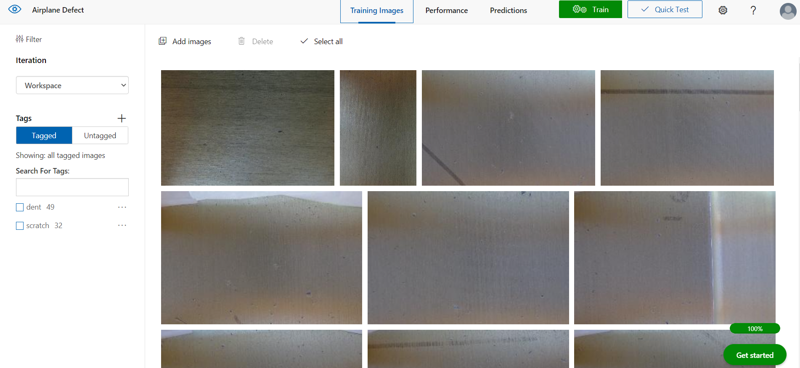
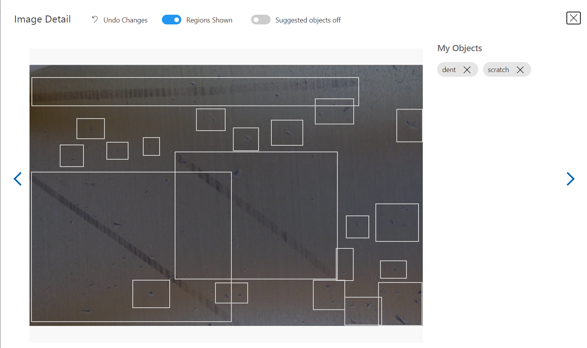
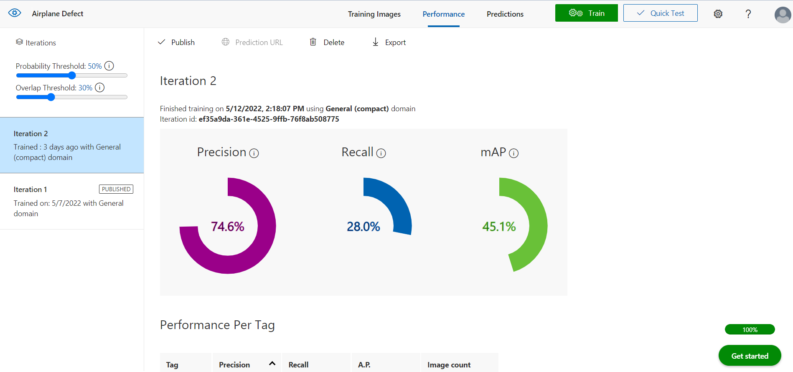

# ai-sees

Airplane Part Detection using Azure Custom Vision (TFJS) via NODEJS

How to run the Server using NODE

1. Enter ``npm install`` in the command prompt
2. Enter ``node server.js`` in the command prompt along with the react js code 

How to get the TFJS Model via Azure Custom Vision:
1. We get the datasets in the Azure Custom Vision

2. We label the datasets from having dent 

3. Quick Train

4. We get this results 

5. Make sure that your setting changed from General to General (compact) so that it will get the export function

6. Export as a Tensorflow code